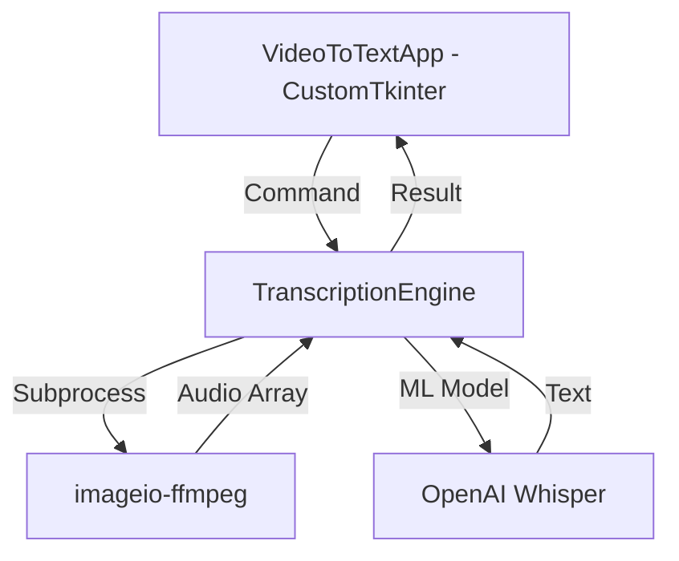

# Antigravity Development Session Log: VideoToText Environment Resolution

**Project:** VideoToText (Python/Whisper/Tkinter)  
**Environment:** Windows 10, Acer Aspire E5-573G (i7-5500U / NVIDIA 920M)  
**Status:** Active Troubleshooting & Environment Stabilization

---

## 1. The "Double Documents" Conflict
During the session, it was identified that the Windows system had two conflicting "Documents" paths (likely due to OneDrive mirroring). This caused persistent Permission Denied and Unable to handle errors when the IDE tried to execute the python.exe within the virtual environment.

| Issue | Resolution |
| :--- | :--- |
| OneDrive File Locking | Moved project to a neutral directory (`C:\projects\video-to-text`). |
| Interpreter Path Mismatch | Used workspace-relative path in `settings.json`. |
| Permission Restrictions | Enabled "Run as Administrator" for the Antigravity IDE. |

---

## 2. Verified Workspace Configuration
The `.vscode/settings.json` file must contain the following to ensure the IDE bridges correctly to the local environment:

```json
{
    "python.defaultInterpreterPath": "${workspaceFolder}\\venv\\Scripts\\python.exe",
    "python.terminal.activateEnvInSelectedTerminal": true
}
```

---

## 3. Git Milestones
*   **Initial Fix:** Pushed stable interpreter path settings to the repository.
*   **Recovery:** Used `git checkout .vscode/settings.json` to restore the configuration after an accidental Timeline rollback.
*   **Correction:** Updated the repository to use `${workspaceFolder}` variables instead of hardcoded Anaconda paths.

---

## 4. The Learning Journey: Strategy & Approach
This project is serving as a foundational learning experience for full-stack automation and GUI development. The following educational goals have been prioritized:

### Educational Objectives:
*   **Environment Management:** Understanding virtual environment isolation and IDE-to-system handshakes.
*   **Version Control Mastery:** Utilizing Git not just for backup, but for state-recovery and "undoing" configuration errors.
*   **Modular Programming:** Transitioning from simple scripts to an Object-Oriented (OO) structure using Python classes.

### Pro-Active Learning Challenges:
*   **"Break and Fix" Exercises:** Intentionally modifying `settings.json` or `.gitignore` to see how the system reacts, then using the terminal to restore stability.
*   **UI Evolution:** Comparing the standard Tkinter library with modern wrappers like `customtkinter` to understand widget properties and inheritance.
*   **Asynchronous Logic:** Learning how to run heavy tasks (like the Whisper model) in the background so the GUI doesn't freeze—a vital concept in software engineering.

---

## 5. Pending UI Logic
The next practical step involves updating `app.py` to provide better user feedback during the transcription process:

**Proposed Logic Change in `start_logic`:**
```python
self.status_label.configure(text="Status: Processing... Please wait.", fg_color="yellow")
```

---
*This log is maintained to ensure continuity in development sessions.*

## Session 2: Learning Focus & Stabilization (2026-04-23)
**Current Status:** Environment stabilized. App version locked (no code changes requested).
**Focus:** Purely conceptual learning and architectural understanding.
### Learning Note: Environment Handshakes & Portability
*   **Variable Usage:** Switched from hardcoded paths to `${workspaceFolder}` variables. This prevents "Permission Denied" errors caused by OneDrive mirroring and ensures the project works regardless of the parent directory's name.
*   **The Venv Bubble:** The virtual environment (`venv`) acts as an isolated container. The "Handshake" is the process where the IDE detects this folder and directs all commands (like `python app.py`) to the specific interpreter inside it, rather than the global system Python.

### Learning Note: Git as a Recovery Tool
*   **Command:** `git checkout [file]` is used to discard local changes and restore a file to its last committed state. 
*   **Strategy:** This enables "Fearless Experimentation"—the ability to intentionally modify configurations to observe failure modes, knowing that a single command can instantly restore stability. It is superior to standard "Undo" because it persists across sessions.

### Learning Note: Asynchronous Logic (Threading)
*   **The Main Thread:** Responsible for UI responsiveness (button clicks, window movement). Heavy tasks like Whisper transcription will "freeze" this thread if run directly.
*   **Worker Threads:** Using `threading.Thread` allows the app to process data in the background while keeping the UI alive.
*   **Thread Safety:** Threads cannot update the UI directly. The `root.after()` method is used to safely schedule UI updates from a background thread back onto the Main Thread.

### Learning Note: UI Architecture (Android Dev Perspective)
*   **Layouts:** Unlike Android's XML layouts, Tkinter UI is defined programmatically. The `.pack()` method functions similarly to a vertical `LinearLayout` (gravity: top).
*   **Widgets:** 
    *   `tk.Label` ≈ `TextView`
    *   `tk.Button` ≈ `Button`
    *   `filedialog` ≈ `Intent.ACTION_GET_CONTENT`
*   **Event Handling:** The `command=` attribute in Tkinter replaces `setOnClickListener`.
*   **Event Loop:** `root.mainloop()` is the equivalent of the Android Main UI Thread/Looper, responsible for rendering and user input.

### Learning Note: Styling & Themes
*   **Inline Styling:** Standard Tkinter uses inline attributes (e.g., `bg="blue"`, `fg="white"`). This is equivalent to hardcoding attributes in an Android XML tag.
*   **Themed Tkinter (ttk):** The `ttk.Style` class allows for a more centralized styling approach, similar to `styles.xml` in Android. It separates the widget's logic from its appearance.
*   **Modern UI Libraries:** Libraries like `customtkinter` provide "Modern/Material" features (rounded corners, dark mode, hover states) that standard Tkinter lacks, making it the preferred choice for premium desktop apps.

### Side-by-Side: Android XML vs. Python ttk.Style
| Feature | Android (XML) | Python (ttk.Style) |
| :--- | :--- | :--- |
| **Style Definition** | `<style name="MyStyle">` | `style.configure("MyStyle.TButton", ...)` |
| **Layout Manager** | `ConstraintLayout / Linear` | `.pack() / .grid() / .place()` |

### Learning Note: Single-File vs. Split-File (Android vs. Python)
*   **Android (Declarative):** Uses XML to separate "What it looks like" from Java/Kotlin's "How it works." This is ideal for large teams and specialized UI tools.
*   **Python/Tkinter (Imperative):** Logic and design are unified in the code. This removes the need for "View Binding" or `findViewById`, as the code directly creates and controls the objects.
*   **Trade-off:**
    *   *Android:* Higher organization, better design tools, but more "boilerplate" code to connect UI and logic.
    *   *Python:* Extremely fast prototyping and direct control, but can become "spaghetti code" if the file gets too large (mitigated by using Classes/MVC patterns).

---
### Session 3: Modernization & Modular Refactoring (2026-04-23)
**Current Status:** App fully refactored. Environment updated with `customtkinter`.
**Focus:** UI Evolution, Modular Architecture (Separation of Concerns).

### Learning Note: The "Engine" Pattern (Separation of Concerns)
*   **The Problem:** Previously, `app.py` had UI code (buttons, labels) mixed with heavy logic (FFmpeg, Whisper). This made it hard to test the transcription logic without launching a window.
*   **The Solution:** Created `TranscriptionEngine`. This class has NO knowledge of the UI. It only cares about "Video In -> Text Out." This makes the code more professional and easier to maintain.
*   **Lazy Loading:** The Whisper model is heavy (~150MB+ for 'base'). Instead of loading it as soon as the app opens, we use a `@property` to load it only when the user first clicks "Start Transcribe." This makes the initial app startup instant.

### Learning Note: Modernizing with CustomTkinter
*   **Why ctk?** Standard Tkinter relies on the OS's native (and often old) drawing tools. `customtkinter` (ctk) draws its own widgets, allowing for rounded corners, smooth animations, and high-DPI support on Windows 10/11.
*   **Grid vs. Pack:** Switched from `.pack()` (sequential stacking) to `.grid()` (coordinate-based layout). Grid is more powerful for complex UIs, allowing for precise control over columns and rows.
*   **Thread-Safe UI Updates:** Background threads cannot touch UI elements directly. We used `self.after(0, task)` to "send" the update request back to the Main Thread safely.

### New Architecture Diagram:


### Git Milestone:
*   **Refactor:** Migrated codebase from standard Tkinter to CustomTkinter.
*   **Modularity:** Isolated business logic into `TranscriptionEngine` class.
*   **Dependency:** Added `customtkinter` to the environment.

---
*This log is maintained to ensure continuity in development sessions.*
